**Unity转小米快游戏（小游戏）工具使用说明文档**

**视频教程**

地址：https://kpan.mioffice.cn/webfolder/ext/8EhBM8oTtYY%40?n=0.5625941541150863 

密码：0a9T

**github：**https://github.com/houqingfeng/unitytomiqgame

**问题：**

1. 手机打开出现加载失败，请重试的页面
1. 检查包名是否在小米开发者平台注册过
2. 如果确认包名没问题，可以用测试包名来测试 com.demo.ch.mini
2. 手机打开游戏一直处于白屏状态，是什么原因？
1. 第一种解决办法：可以把wasm文件放在服务器上
2. 第二种解决办法：检查手机是否是低端机，如果是低端机可以换成性能好的高端机，启动起来游戏，然后做wasm分包处理。
3. 第三种解决办法：检查wasm是否过大，如果过大请优化，建议**30M**以下。

**一、转换工具链接**

http://tennews.cn/MiQGameConverter.unitypackage

支持的unity版本**2021**、**2020**，**2019**。

结构：

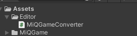

**二、使用步骤**

\1. **点击菜单栏 小米快游戏/打包设置**

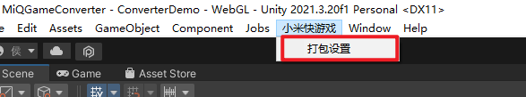

\2. **弹出操作窗口**

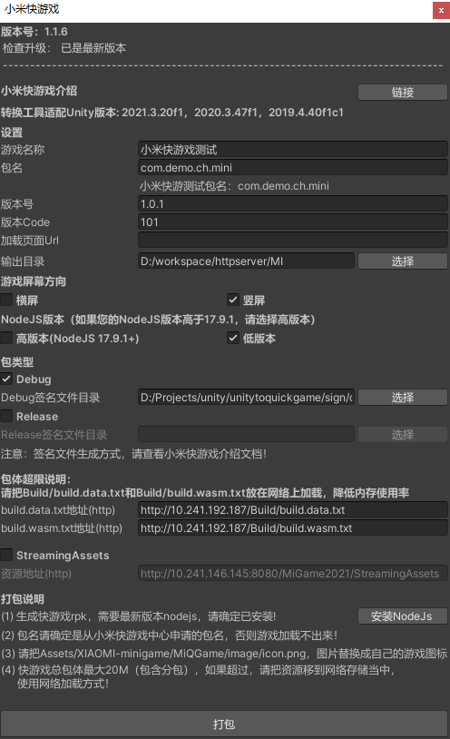

参数说明：

1. 游戏名称：小米快游戏名称。
2. 包名：在小米快游戏中心申请的包名，一定要填写正确的包名，否则会导致加载失败。
3. 版本号：版本号。
4. 版本code：版本code。
5. 加载页面Url：游戏加载过程当中页面，用来
6. 输出目录：打包输出目录，此目录每次打包都会清空，请注意选择合适的目录。
7. 游戏方向：横屏或者竖屏。
8. 包类型：debug或者release包。release包需要release签名文件，请设定release签名文件所在的目录。
9. 包体超限：由于快游戏包体大小限定，unity游戏资源较多的情况下，可以使用此项，把打出来资源放在服务器上，使用远程资源加载。
10. 打包：执行打包操作。

\3. **打包完成会打开打包目录。如下所示：**

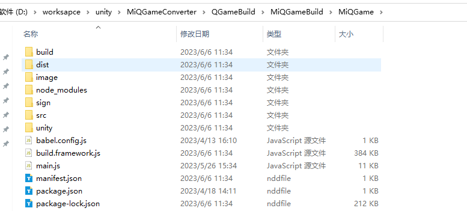

MQGame即为**小米快游戏工程**。

转换完成会在dist目录下生成快游包：

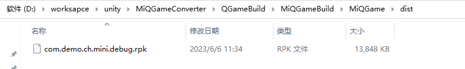

在此目录下，也可以手动执行npm命令生成快游戏包。

1. npm install命令安装快游戏依赖包；
2. npm run build 或者npm run release生成对应的debug包和release包。
3. npm run server，可以生成启动调试服务器，使用快游戏调试器（下载地址：https://www.quickapp.cn/docCenter/post/69），扫描二维安装即可启动游戏。注意：需要把调试器环境切换为：com.miui.hybrid环境！！！

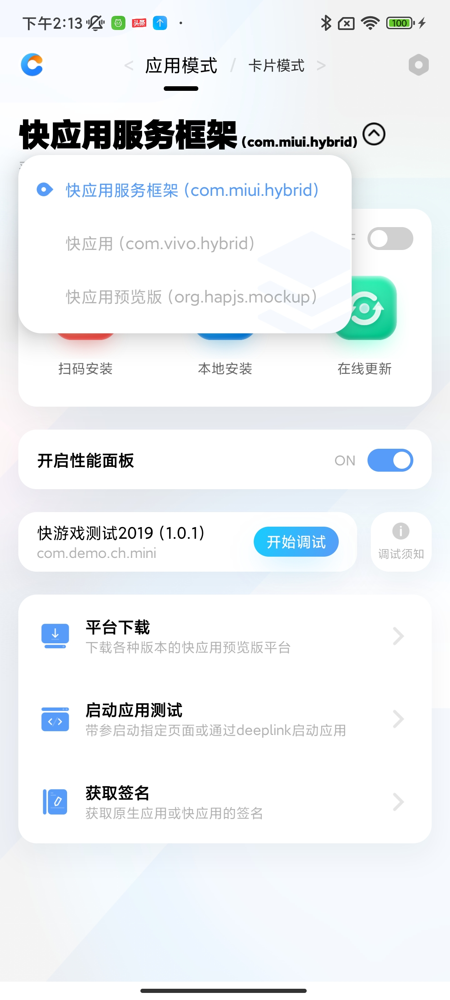

**三、优化建议**

1. 包体过大，或者遇见out of memory，可以把这两两项改为如下选项，优化包体和内存。

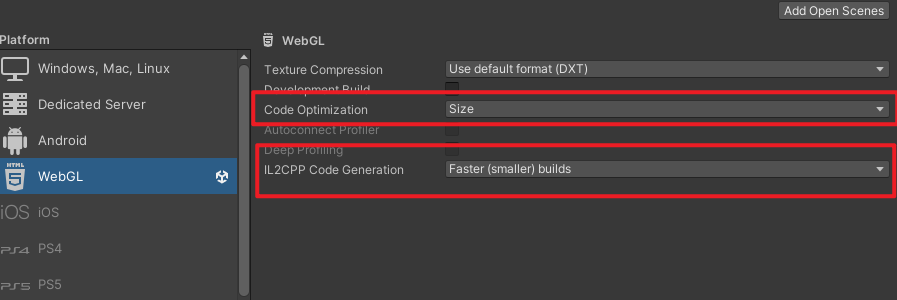

**注意！！！Unity基础功能使用说明**

unity转快游戏，有些unity功能是不能直接在快游戏里面使用的，需要在unity层使用的时候做一些适配工作。

\1. **Websocket（可选）**

示例：WebSocket服务器搭建完成后，在客户端场景物体上挂载示例脚本Connection，并修改Connection脚本中的IP地址即可。

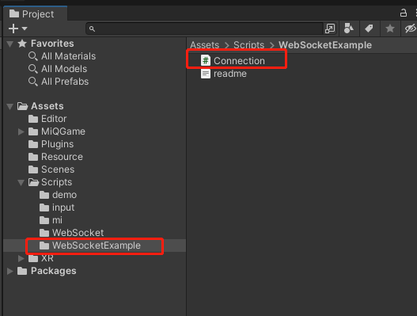

\2. **InputField（必须）**

在挂载输入框组件的物体上，需手动挂载一个脚本。 如果使用的是 InputField (Legacy) 组件则手动挂载 WebglInput 脚本，使用的是 InputField (TMP)组件则手动挂载 WebglInputTMP 脚本。

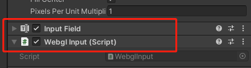

**四、快游戏功能接入**

转换工具提供的快游戏功能有：登录、支付、广告、文件读写、创建游戏图标，key-value本地存储等功能。

**1、 初始化**

初始化需要在调用sdk功能之前调用，确保初始化完成，才能使用SDK功能。

例子：

|JSON //初始化 MiBridge.Instance.Init();|
| :- |
**2、 登录和获取用户信息**

|JSON //快游戏小米账号登录 MiBridge.Instance.Login((accountId, session) => { `    `MiBridge.Instance.QGLog("login account id={0}, session={1}", accountId, session); `    `MiBridge.Instance.GetUserInfo((nickName, avatarUrl, gender) => `    `{ `        `MiBridge.Instance.QGLog("get user info nickName={0}, avatar={1}, gender={2}", nickName, avatarUrl, gender); `    `}, (code, msg) => `    `{ `        `MiBridge.Instance.QGLog("get user info error code={0}, msg={1}", code, msg); `    `}); }, (code, msg) => { `    `MiBridge.Instance.QGLog("login error code={0}, msg={1}", code, msg); });|
| :- |
**3、支付**

支付接入需要服务器接入，具体服务器接入方式请查看小米开发者文档：https://dev.mi.com/distribute/doc/details?pId=1109。

|JSON //订单信息 OrderInfo orderInfo = new OrderInfo { `    `appId = "1",               // 游戏唯一ID `    `appAccountId = 12,         // 与登录接口返回的appAccountId一致 `    `session = "1",             // 与登录接口返回的session一致 `    `cpOrderId = "1",           // 游戏订单号 `    `cpUserInfo = "",           // cp透传信息 (非空) `    `displayName = "1",         // 支付的时候显示的商品名称 `    `feeValue = 100,            // 价格 单位分 `    `sign = "1",                // 签名 用于校验 具体生成方式，请查看：https://dev.mi.com/distribute/doc/details?pId=1109 };  //支付接口 MiBridge.Instance.Pay(orderInfo, (success, code, msg) => { `    `MiBridge.Instance.QGLog("pay result success={0}, code={1}, msg={2}", success, code, msg); });|
| :- |
**4、广告**

**4.1、Banner广告**

|JSON /// 
 /// 创建banner广告 /// 
 /// <param name="adId">广告id</param> /// <param name="listener">监听器</param> /// <returns></returns> ` `MiBridge.Instance.CreateBannerAd("81e6cbe35e56b53eebbc547fd1bc5614", new AdEventListener {  `    `onAdError = (code, msg) => { `        `MiBridge.Instance.QGLog("c# ad error"); `    `},      `    `onAdClose = (isEnd) => { `        `MiBridge.Instance.QGLog("c# ad close"); `    `},  `    `onAdLoad = (info) => { `        `MiBridge.Instance.QGLog("c# ad load"); `    `}, });  /// 
 /// 隐藏广告 /// 
 /// <param name="adId"></param> MiBridge.Instance.HideAd("81e6cbe35e56b53eebbc547fd1bc5614");  /// 
 /// 销毁广告，销毁后，如需重新显示，请先调用创建广告 /// 
 /// <param name="adId"></param> MiBridge.Instance.DestroyAd("81e6cbe35e56b53eebbc547fd1bc5614");|
| :- |
**4.2、插屏广告**

|JSON /// 
 /// 创建插屏广告 /// 
 /// <param name="adId">广告id</param> /// <param name="listener">监听器</param> /// <returns></returns> MiBridge.Instance.CreateInterstitialAd("f54f3dfc0ba63cf3dbf582816ee069d7", new AdEventListener { `    `onAdError = (code, msg) => { `        `MiBridge.Instance.QGLog("c# insert ad error"); `    `},  `    `onAdClose = (end) => { `        `MiBridge.Instance.QGLog("c# insert ad close"); `    `},  `    `onAdLoad = (info) => { `        `MiBridge.Instance.QGLog("c# insert ad load"); `    `}, });  /// 
 /// 展示插屏广告测试 /// 
 MiBridge.Instance.ShowAd("f54f3dfc0ba63cf3dbf582816ee069d7");  /// 
 /// 销毁插屏广告测试 /// 
 MiBridge.Instance.DestroyAd("f54f3dfc0ba63cf3dbf582816ee069d7");|
| :- |
**4.3、Native广告**

|JSON /// 
 /// 创建原生广告 /// 
 /// <param name="adId">广告id</param> /// <param name="listener">监听器</param> /// <returns></returns> MiBridge.Instance.CreateNativeAd("da11b7e8c582ee7d1acf16a627ea6b34", new AdEventListener { `    `onAdError = (code, msg) => { `        `MiBridge.Instance.QGLog("c# native ad error"); `    `},  `    `onAdClose = (end) => { `        `MiBridge.Instance.QGLog("c# native ad close"); `    `},  `    `onAdLoad = (info) => { `        `MiBridge.Instance.QGLog("c# native ad load"); `    `}, });  /// 
 /// 加载广告 /// 
 /// <param name="adId"></param> MiBridge.Instance.LoadAd("da11b7e8c582ee7d1acf16a627ea6b34");  /// 
 /// 展示广告 /// 
 /// <param name="adId"></param> MiBridge.Instance.ShowAd("da11b7e8c582ee7d1acf16a627ea6b34");  /// 
 /// 销毁广告，销毁后，如需重新显示，请先调用创建广告 /// 
 /// <param name="adId"></param> MiBridge.Instance.DestroyAd("da11b7e8c582ee7d1acf16a627ea6b34");|
| :- |
**4.4、激励视频广告**

|JSON /// 
 /// 创建激励视频广告 /// 
 /// <param name="adId">广告id</param> /// <param name="listener">监听器</param> /// <returns></returns> MiBridge.Instance.CreateRewardedVideoAd("77295ab0558fa54fc5cc9ed6a28b6da7", new AdEventListener { `    `onAdError = (code, msg) => { `        `MiBridge.Instance.QGLog("c# reward ad error"); `    `},  `    `onAdClose = (end) => { `        `string info = "success"; `        `if (!end) { `            `// end == true 说明激励视频播放完毕，是正常结束 `            `info = "failure"; `        `} `        `MiBridge.Instance.QGLog($"c# reward ad close end={info}"); `    `},  `    `onAdLoad = (info) => { `        `MiBridge.Instance.QGLog("c# reward ad load"); `    `}, });  /// 
 /// 加载广告 /// 
 /// <param name="adId"></param> MiBridge.Instance.LoadAd("77295ab0558fa54fc5cc9ed6a28b6da7");  /// 
 /// 展示广告 /// 
 /// <param name="adId"></param> MiBridge.Instance.ShowAd("77295ab0558fa54fc5cc9ed6a28b6da7");|
| :- |
**4.5、互推盒子广告**

|JSON /// 
 /// 展示互动盒子广告 /// 互动盒子广告介绍：https://dev.mi.com/distribute/doc/details?pId=1442 /// 
 /// <param name="adId">广告id</param> /// <param name="type"> /// 广告类型:  /// 1. type=100，    互推盒子-九宫格  /// 2. type=120，    互推盒子-横幅  /// 3. type=130/140，互推盒子-抽屉，    白色背景为130，黑色背景为140 /// 4. type=150，    互推盒子-悬浮球 /// </param> /// <param name="listener">监听器</param> /// <returns></returns> MiBridge.Instance.ShowRecommendAd("da11b7e8c582ee7d1acf16a627ea6b34", 100, (success, msg) =>  {  });  /// 
 /// 关闭互动盒子广告 /// 互动盒子广告介绍：https://dev.mi.com/distribute/doc/details?pId=1442 /// 
 /// <param name="adId">广告id</param> /// <param name="type"> /// 广告类型:  /// 1. type=100，    互推盒子-九宫格  /// 2. type=120，    互推盒子-横幅  /// 3. type=130/140，互推盒子-抽屉，    白色背景为130，黑色背景为140 /// 4. type=150，    互推盒子-悬浮球 /// </param> /// <param name="listener">监听器</param> MiBridge.Instance.CloseRecommendAd("da11b7e8c582ee7d1acf16a627ea6b34", 100, (success, msg) => {  });|
| :- |
**5、文件操作**

**5.1、读文件**

|JSON MiBridge.Instance.ReadFile("log.txt", (data, len) => { `    `string test = System.Text.Encoding.ASCII.GetString(data); `    `MiBridge.Instance.QGLog("MiBridge.Instance.ReadFile success {0}, {1}", len, test); }, (msg) => { `    `MiBridge.Instance.QGLog("read file failure {0}", msg); });|
| :- |
**5.2、写文件**

|JSON string myString = "Hello world!!!"; byte[] data = Encoding.UTF8.GetBytes(myString); MiBridge.Instance.WriteFile("log.txt", data, false, (success, msg) => { `    `MiBridge.Instance.QGLog("write file {0}, {1}", success, msg); });|
| :- |
**5.3、删除文件**

|JSON MiBridge.Instance.DeleteFile("log.txt", (success) => {  });|
| :- |
**6、游戏图标**

|JSON MiBridge.Instance.HasShortcut( has => { `        `if (has) `        `{ `            `MiBridge.Instance.QGLog("has short cut"); `        `} `        `else  `        `{ `            `MiBridge.Instance.QGLog("has not short cut"); `            `MiBridge.Instance.CreateShortcut("便于打开游戏", (success, code, msg) => { `                `MiBridge.Instance.QGLog("create short cut {0}, {1}, {2}", success, code, msg); `        `}); `    `} });|
| :- |
**7、KV存储**

支持四种类型存储：int，float，double和string类型。

存和读操作：

|JSON MiBridge.Instance.SetKVInt("int", 1); var kvInt = MiBridge.Instance.GetKVInt("int"); MiBridge.Instance.QGLog("get int kv={0}", kvInt);  MiBridge.Instance.SetKVFloat("float", 2.0522222f); var kvFloat = MiBridge.Instance.GetKVFloat("float"); MiBridge.Instance.QGLog("get float kv={0}", kvFloat);  MiBridge.Instance.SetKVDouble("dobule", 3.2656453453d); var kvDouble = MiBridge.Instance.GetKVDouble("dobule"); MiBridge.Instance.QGLog("get dobule={0}", kvDouble);  MiBridge.Instance.SetKVString("string", " fsdfsdf "); var kvString = MiBridge.Instance.GetKVString("string"); MiBridge.Instance.QGLog("get string={0}", kvString);|
| :- |
删除操作：

|JSON MiBridge.Instance.DeleteKV("int");|
| :- |
**8、日志打印到快游戏平台**

|JSON MiBridge.Instance.QGLog("hello world！");|
| :- |
**五、调试**

快游戏只能**真机**调试

1. 小米手机开启USB调试模式
2. 浏览器调试
1. **edge**浏览器调试
1. 输入 edge://inspect/#devices
2. **chrome**浏览器调试
1. 输入 chrome://inspect/#devices
3. 点击 **inspect**进入调试页面

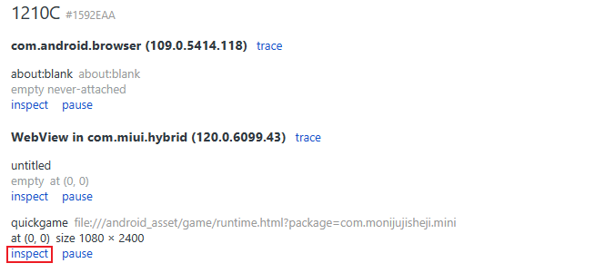

**六、生成证书**

\1. [**下载快应用IDE**](https://www.quickapp.cn/)

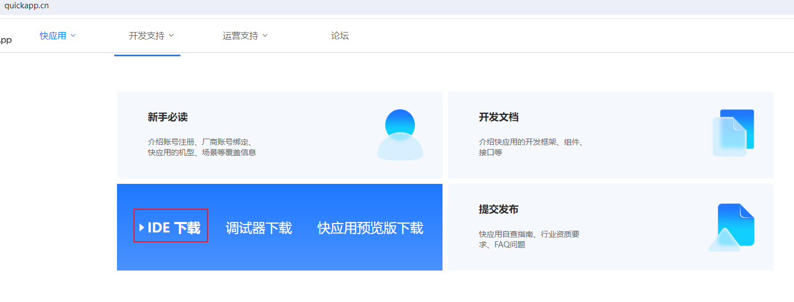

\2. **打开一个工程（任意一个工程）**

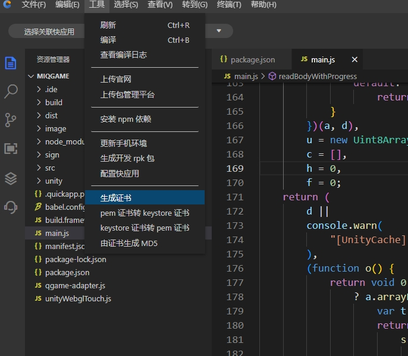
