# Unity WeGL 小米小游戏适配

## 📌 目录
- [简介](#-简介)
- [安装](#️-安装)
- [使用](#-使用)
- [性能优化](#-性能优化)
- [能力适配](#-能力适配)
- [常见问题 (QA)](#-常见问题-qa)

## 📖 简介

### 概述
欢迎使用 Unity WebGL 小米小游戏适配（转换）方案，本方案设计目的是**降低 Unity 游戏转换到小米小游戏的开发成本**。基于WebAssembly技术，无需更换Unity引擎与重写核心代码的情况下将原有游戏项目适配到小米小游戏。
👉 工具与文档项目开放地址：[Unity WebGL小米小游戏适配方案](https://dev.mi.com/xiaomihyperos/documentation/detail?pId=2165)

### 支持引擎
转换插件理论上支持的引擎版本涵盖：**Unity2019~2022、团结引擎1.x**
> 建议使用2021及以上版本，支持设置纹理ASTC压缩格式来优化运行时内存。

### 方案特点
- 保持原引擎工具链与技术栈
- 无需重写游戏核心逻辑，支持大部分第三方插件
- 由转换工具与小米小游戏运行环境保证适配兼容，保持较高还原度
- 小米小游戏平台能力以 C# SDK 方式提供给开发者，快速对接平台开放能力

### 接入流程
接入流程主要包含以下几个环节：

- 阶段一 兼容性评估：初步确认技术方案是否符合游戏项目。
- 阶段二 项目转换：可体验的 WebGL、小游戏项目。
- 阶段三 小米小游戏平台能力接入：接入更多平台能力。
- 阶段四 体验调优：达到可上线标准的小游戏体验。
- 阶段五 发布上线与现网监控：上线后的问题排查与分析。

### 更新日志
详见《[更新日志](CHANGELOG.md)》文档。

## 🛠️ 安装
目前小米 SDK 仅提供以 `unitypackage` 资源包形式将 SDK 导入到游戏工程中。

### 插件包安装
UnityPackage: [点击下载unity工具插件1.6.0版本](MiQGameConverter_1.6.0.unitypackage)，并将插件包导入游戏工程。

导入成功后Unity IDE工具栏会多出小米快游戏，如下图所示:
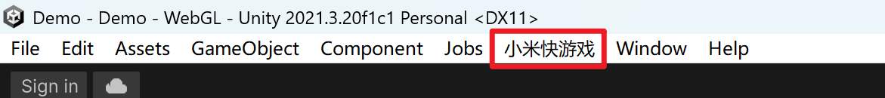

### 插件包目录
导入成功后，会自动在工程代码 `Assets` 目录下创建 `XIAOMI-minigame` 目录，如下图所示：
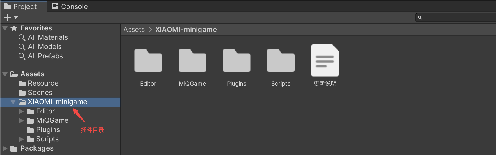

整体结构如下：

    XIAOMI-minigame/
    ├── Editor/ # 转换工具窗口代码
    ├── MiQGame/ # 小米快游戏工程模版
    ├── Plugins/ # JS 插件，处理 C# 与 JS 通信
    ├── Runtime/ # API 和功能适配代码
    ├── demo/ # API 使用示例代码
    ├── input/ # InputField 适配代码
    ├── touch/ # 触控适配代码
    ├── mi/ # C# SDK
    │ ├── MiModel/ # API 中的实体类（请求参数和返回参数）
    │ ├── MiBridge/ # 调用 API 代码入口
    │ ├── MiAudioPlayer/ # 媒体 API - 音频
    │ ├── MiGetOptions/ # 生命周期 API
    │ ├── MiKeyBoard/ # 软键盘 API
    │ ├── MiVideo/ # 视频 API
    │ ├── MiTouch/ # 触摸 API
    │ └── 更新说明/ # 版本更新日志
    └── 根目录/Editor/ # 提供构建 WebGL 及转小米小游戏功能

- 根目录/Editor/：提供了构建webgl及转小米小游戏工程功能
- 根目录/MiQGame/Plugins：为C#调用JS平台能力的胶水代码
- 根目录/Runtime/：含一套C# SDK，方便C#环境调用小游戏的JS平台能力，详见使用文档《[unity游戏适配C# API](#小米-sdk-平台能力适配)》

## 🚀 使用

### 导出小米小游戏

#### 一、Switch Platform WebGL(首次选择时需要)
打开 **Build Settings**，选择 **WebGL**，点击 **Switch Platform**；

**相关配置选项建议如下：**
    - Code Optimization 选择`Speed`，
    - IL2CPP Code Generation 选择`Faster(smaller) builds`，
    - Unity 2021及以上版本的 "Texture Compression" 选择 `ASTC`。
    效果如下：
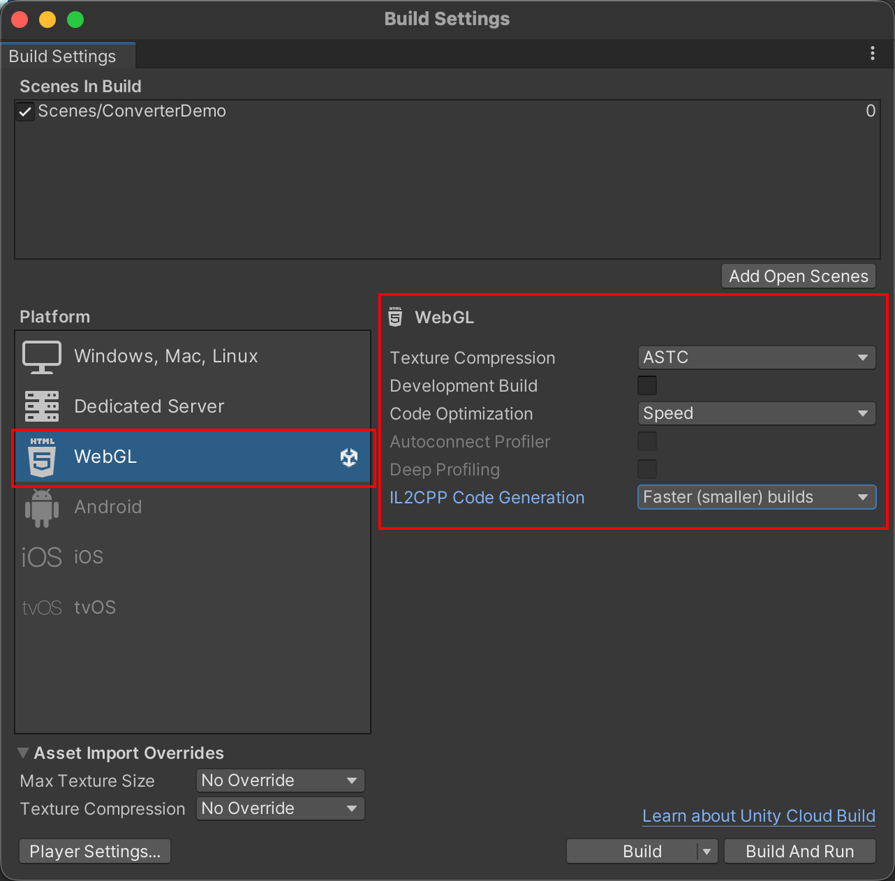

#### 二、转换小游戏
1. **点击菜单栏 小米快游戏/转换快游戏**
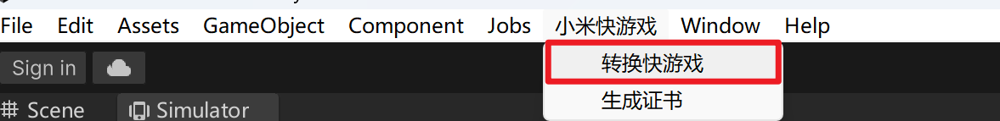

2. **弹出操作窗口**
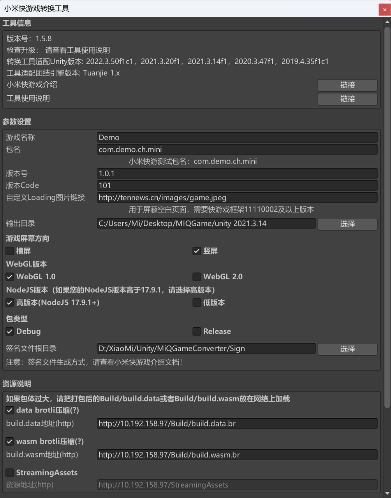
参数说明：
    - 游戏名称：小米快游戏名称。
    - 包名：在小米快游戏中心申请的包名，一定要填写正确的包名，否则会导致加载失败。
    - 版本号：版本号。
    - 版本code：版本code。
    - 自定义Loading图片链接：游戏加载过程当中页面内容，用来过渡以留住玩家
    - 输出目录：打包输出目录，此目录每次打包都会清空，请注意选择合适的目录。
    - 游戏屏幕方向：横屏或者竖屏。
    - WebGL版本：WebGL1.0 或者 WebGL2.0
    - 包类型：debug或者release包。需要签名文件，请设定签名文件所在的根目录。详见《[生成证书](#生成证书)》 。
    - data/wasm brotli压缩:  对生成的data/wasm资源进行brotli压缩，本地加载可减少包体大小，网络加载可以加快下载速度，详见《[性能优化](#-性能优化)》。
    - build.wasm/data地址: 本地加载不填，网络加载需要填写文件http地址（brotli压缩的文件需加上.br扩展名）。
    - StreamingAssets：使用AssteBundle或Addressable需开启，需填入StreamingAssets根目录http地址。
    - 打包：执行打包操作。

3. **打包和调试**
打包完成会打开打包目录。如下所示：
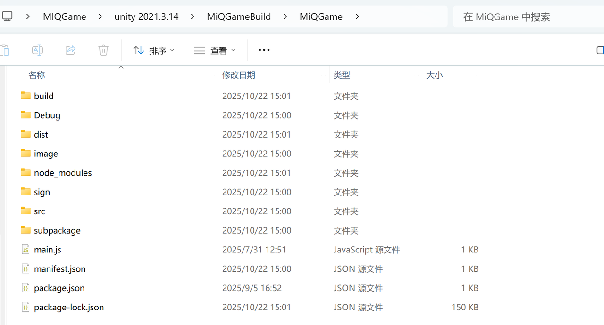
<span style="color:rgb(52, 107, 231);">MQGame</span>即为**小米快游戏工程**。
转换完成会在<span style="color:rgb(52, 107, 231);">dist</span>目录下生成游戏包：
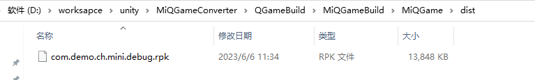
在<span style="color:rgb(52, 107, 231);">MQGame</span>目录下，也可以手动执行npm命令生成快游戏包。
    1. npm install命令安装快游戏依赖包；
    2. npm run build 或者npm run release生成对应的debug包和release包。
    3. 使用快应用调试器（下载地址：https://www.quickapp.cn/docCenter/post/69 ，本地安装即可启动游戏。注意：需要把调试器环境切换为：com.miui.hybrid环境！！！详见使用文档《[调试指南](https://dev.mi.com/xiaomihyperos/documentation/detail?pId=2123)》
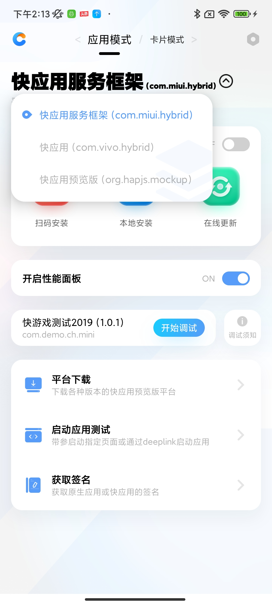

### 生成证书
#### 1. 点击菜单栏 小米快游戏/生成证书
打开生成证书面板如下：
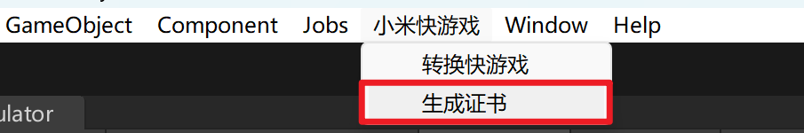
#### 2. 配置参数后生成证书
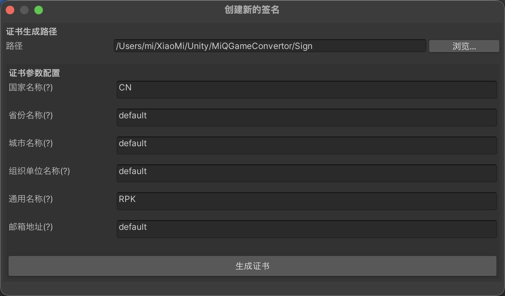

## ⚡ 性能优化

### 1. 包体限制及优化

#### 包体大小限制
Unity插件导出的小游戏包体大小较大，目前分包在30MB左右，线上平均网络速度 1-2Mb/s，Unity小游戏启动，需要将主包+分包（30Mb）都下载下来，才能正常渲染画面，以线上网速大概需要15~30s，耗时较长。

#### 优化建议
- 原始代码包(webgl/Build目录下的wasm文件)建议不超过30MB，建议开发者勾选"Strip Engine Code"并设置"Managed Stripping Level"为High。
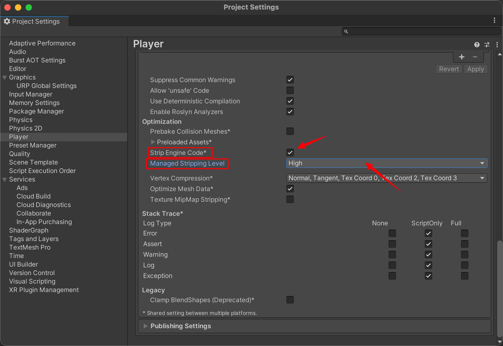
- 包体过大，或者遇见out of memory，可以把这两两项改为如下选项，优化包体和内存。
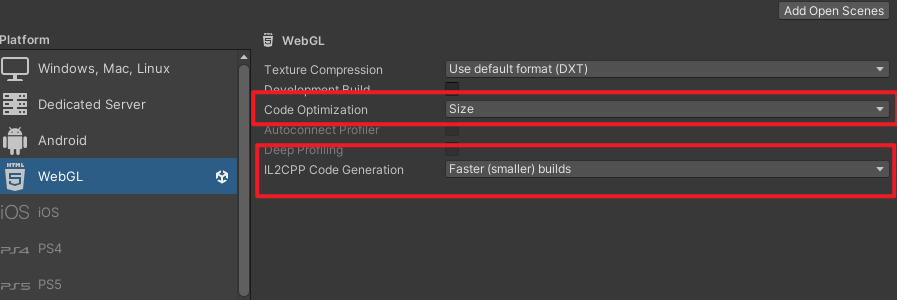

#### 优化wasm/data资源大小
- 工具内开启brotli压缩，可显著降低data和wasm资源大小，从而降低包体大小。

### 2. 启动速度优化

#### 优化的目标与标准
目前普通小游戏普遍启动时间为7~10s，而如果不经优化的Unity WebGL游戏启动会是该时间的2-3倍以上。我们建议开发者将启动优化作为上线前最为重要的事项。

#### 优化建议
1. 建议优先将wasm和data资源放在本地加载，根据需要开启brotli压缩
    1. 包体不超限的情况下（rpk<=60M），可不开启brotli压缩
    2. 包体超限，但开启btotli压缩后包体不超限，则需开启brotli压缩
    3. 包体超限较大，需要使用网络加载wasm/data资源，强烈建议开启brotli压缩，减少资源下载时间
2. 游戏内资源按需加载，优化可参考 使用[Addressable Assets System](https://docs.unity3d.com/Packages/com.unity.addressables@1.1/manual/index.html)或[AssetBundle](https://docs.unity3d.com/2021.3/Documentation/Manual/AssetBundlesIntro.html)进行资源按需加载。

3. 小游戏移植优化
参考 https://docs.unity.cn/cn/tuanjiemanual/Manual/MemoryOptimizationOverview.html

## 🔌 能力适配

### 键盘输入法适配
<span style="color:rgb(255, 0, 0);">InputField适配（必须）</span>
<p style="text-indent: 2em;">在挂载输入框组件的物体上，需手动挂载一个脚本。 如果使用的是 InputField (Legacy) 组件则手动挂载 WebglInput 脚本，使用的是 InputField (TMP)组件则手动挂载 WebglInputTMP 脚本。</p>
<p align="center">
    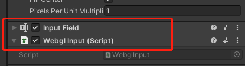
    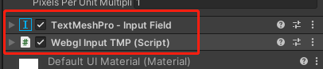
</p>

### 多点触控适配
<span style="color:rgb(255, 0, 0);">重载触控 </span>
将 `MiTouchInputOverride.cs` 脚本挂在 Unity 中的 EventSystem 对象上。也可以对该代码做二次修改，以达到所需要的效果。
<p align="center">
  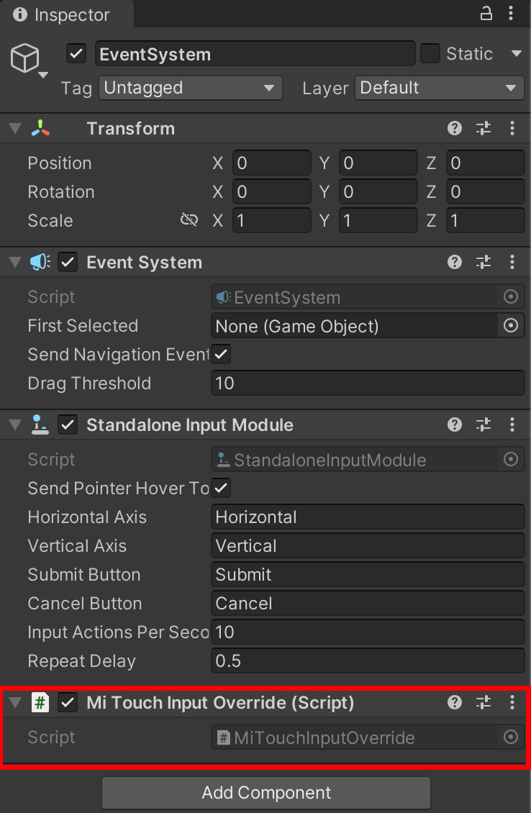
</p>

### 音频适配
目前 UnityAudio 已支持自动适配小米小游戏，优先建议使用 UnityAudio 来播放音频

<span style="color:rgb(255, 0, 0);">WebAudio适配 </span>
在工具面板开启WebAudio选项，开启UnityAudio自动适配，可以提升游戏音频性能

<p align="center">
  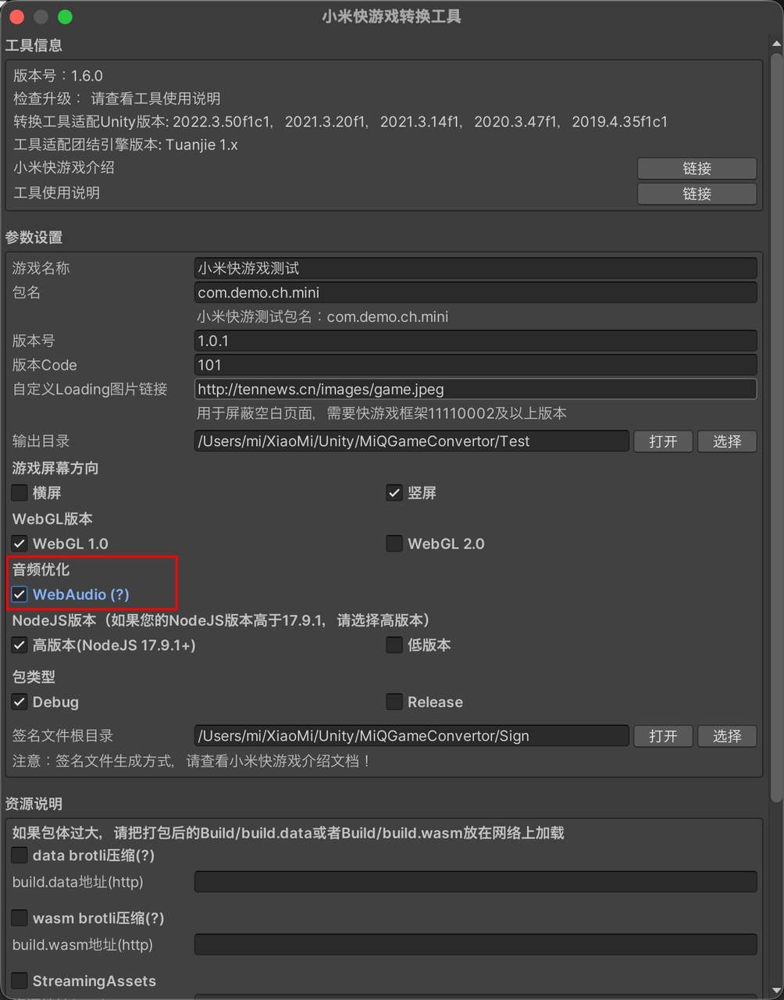
</p>

UnityAudio 原理：
- 长音频播放使用的是InnerAudio
- 短音频播放使用的是WebAudio
- Unity 插件会根据音频文件大小自动适配使用不同的播放方式

### 小米 SDK 平台能力适配
为降低Unity开发者使用平台能力门槛，在小米转换插件中我们内置了C# SDK，开发者可使用熟悉的C#语言进行平台能力的使用。

**注意**: 游戏进度存储使用Unity的PlayerPrefs无法生效，SDK提供了小米小游戏平台的PlayerPrefs，需要区分使用。

转换工具提供的快游戏功能有：登录、支付、广告、文件读写、创建游戏图标，key-value本地存储等。

#### 1. 初始化

初始化需要在调用sdk功能之前调用，确保初始化完成，才能使用SDK功能。

```csharp
// 初始化
MiBridge.Instance.Init();
```

#### 2. 登录和获取用户信息

```csharp
//快游戏小米账号登录
MiBridge.Instance.Login((accountId, session) => {
    MiBridge.Instance.QGLog("login account id={0}, session={1}", accountId, session);
    MiBridge.Instance.GetUserInfo((nickName, avatarUrl, gender) =>
    {
        MiBridge.Instance.QGLog("get user info nickName={0}, avatar={1}, gender={2}", nickName, avatarUrl, gender);
    }, (code, msg) =>
    {
        MiBridge.Instance.QGLog("get user info error code={0}, msg={1}", code, msg);
    });
}, (code, msg) => {
    MiBridge.Instance.QGLog("login error code={0}, msg={1}", code, msg);
});
```

#### 3. 支付

支付接入需要服务器接入，具体服务器接入方式请查看小米开发者文档：https://dev.mi.com/distribute/doc/details?pId=1109。

```csharp
//订单信息
OrderInfo orderInfo = new OrderInfo
{
    appId = "1",               // 游戏唯一ID
    appAccountId = 12,         // 与登录接口返回的appAccountId一致
    session = "1",             // 与登录接口返回的session一致
    cpOrderId = "1",           // 游戏订单号
    cpUserInfo = "",           // cp透传信息 (非空)
    displayName = "1",         // 支付的时候显示的商品名称
    feeValue = 100,            // 价格 单位分
    sign = "1",                // 签名 用于校验 具体生成方式，请查看：https://dev.mi.com/distribute/doc/details?pId=1109
};

//支付接口
MiBridge.Instance.Pay(orderInfo, (success, code, msg) => {
    MiBridge.Instance.QGLog("pay result success={0}, code={1}, msg={2}", success, code, msg);
});
```

#### 4. 广告

###### 4.1 Banner广告

```csharp
/// <summary>
/// 创建banner广告
/// </summary>
/// <param name="adId">广告id</param>
/// <param name="left">横幅广告组件的左上角横坐标</param>
/// <param name="top">横幅广告组件的左上角纵坐标</param>
/// <param name="width">横幅广告组件的宽度</param>
/// <param name="height">横幅广告组件的高度</param>
/// <param name="listener">监听器</param>
/// <returns></returns>
MiBridge.Instance.CreateBannerAd("f618f7543d0f768b1c58292b0616998c", 0, 800, 1080, 300, new AdEventListener
{
    onAdLoad = (info) => { MiBridge.Instance.QGLog("c# banner ad load"); },

    onAdClose = (isEnd) => { MiBridge.Instance.QGLog("c# banner ad close"); },

    onAdError = (code, msg) => { MiBridge.Instance.QGLog("c# banner ad error {0}", msg); },
});

/// <summary>
/// 展示广告
/// </summary>
/// <param name="adId"></param>
MiBridge.Instance.ShowAd("f618f7543d0f768b1c58292b0616998c");


/// <summary>
/// 隐藏广告
/// </summary>
/// <param name="adId"></param>
MiBridge.Instance.HideAd("f618f7543d0f768b1c58292b0616998c");

/// <summary>
/// 销毁广告，销毁后，如需重新显示，请先调用创建广告
/// </summary>
/// <param name="adId"></param>
MiBridge.Instance.DestroyAd("f618f7543d0f768b1c58292b0616998c");
```

###### 4.2 插屏广告

```csharp
/// <summary>
/// 创建插屏广告
/// </summary>
/// <param name="adId">广告id</param>
/// <param name="listener">监听器</param>
/// <returns></returns>
MiBridge.Instance.CreateInterstitialAd("6e969534de88080c3a1eda5d7049477a", new AdEventListener
{
    onAdLoad = (info) => { MiBridge.Instance.QGLog("c# insert ad load"); },

    onAdClose = (end) => { MiBridge.Instance.QGLog("c# insert ad close"); },

    onAdError = (code, msg) => { MiBridge.Instance.QGLog("c# insert ad error"); }
});

/// <summary>
/// 展示插屏广告测试
/// </summary>
MiBridge.Instance.ShowAd("6e969534de88080c3a1eda5d7049477a");

/// <summary>
/// 销毁插屏广告测试
/// </summary>
MiBridge.Instance.DestroyAd("6e969534de88080c3a1eda5d7049477a");
```

###### 4.3 激励视频广告
**注意**：CreateRewardedVideoAd 方法创建的（激励视频广告组件）是一个单例（目前暂不支持多例），只需创建一次，需要使用的时候进行加载和展示即可

```csharp
/// <summary>
/// 创建激励视频广告
/// </summary>
/// <param name="adId">广告id</param>
/// <param name="listener">监听器</param>
/// <returns></returns>
MiBridge.Instance.CreateRewardedVideoAd("8ff5a54ea576d425124c8b179f1bd2ad", new AdEventListener
{
    onAdLoad = (info) => { MiBridge.Instance.QGLog("c# reward ad load"); },

    onAdClose = (end) =>
    {
        string info = "success";
        if (!end)
        {
            info = "failure";
        }

        MiBridge.Instance.QGLog($"c# reward ad close end={info}");
    },

    onAdError = (code, msg) => { MiBridge.Instance.QGLog("c# reward ad error"); },
});

/// <summary>
/// 加载广告
/// </summary>
/// <param name="adId"></param>
MiBridge.Instance.LoadAd("8ff5a54ea576d425124c8b179f1bd2ad");

/// <summary>
/// 展示广告
/// </summary>
/// <param name="adId"></param>
MiBridge.Instance.ShowAd("8ff5a54ea576d425124c8b179f1bd2ad");

```

###### 4.4 原生模板广告

```csharp
/// <summary>
/// 创建原生广告
/// </summary>
/// <param name="adId">广告id</param>
/// <param name="left">模板广告组件的左上角横坐标</param>
/// <param name="top">模板广告组件的左上角纵坐标</param>
/// <param name="width">模板广告组件的宽度</param>
/// <param name="height">模板广告组件的高度</param>
/// <param name="listener">监听器</param>
/// <returns></returns>
MiBridge.Instance.CreateCustomAd("e9a171bfe65386da7ffecf5e5294733f", 0, 700, 1080, 300, new AdEventListener
{
    onAdLoad = (info) => { MiBridge.Instance.QGLog("c# custom ad load"); },

    onAdClose = (end) => { MiBridge.Instance.QGLog("c# custom ad close"); },

    onAdError = (code, msg) => { MiBridge.Instance.QGLog("c# custom ad error"); }
});

/// <summary>
/// 展示广告
/// </summary>
/// <param name="adId"></param>
MiBridge.Instance.ShowAd("e9a171bfe65386da7ffecf5e5294733f");

/// <summary>
/// 销毁广告，销毁后，如需重新显示，请先调用创建广告
/// </summary>
/// <param name="adId"></param>
MiBridge.Instance.DestroyAd("e9a171bfe65386da7ffecf5e5294733f");

```

###### 4.5 互推盒子广告

```csharp
/// <summary>
/// 展示互动盒子广告
/// 互动盒子广告介绍：https://dev.mi.com/distribute/doc/details?pId=1442
/// </summary>
/// <param name="adId">广告id</param>
/// <param name="type">
/// 广告类型: 
/// 1. type=100，    互推盒子-九宫格 
/// 2. type=120，    互推盒子-横幅 
/// 3. type=130/140，互推盒子-抽屉，    白色背景为130，黑色背景为140
/// 4. type=150，    互推盒子-悬浮球
/// </param>
/// <param name="listener">监听器</param>
/// <returns></returns>
MiBridge.Instance.ShowRecommendAd("da11b7e8c582ee7d1acf16a627ea6b34", 100, (success, msg) =>
{
    MiBridge.Instance.QGLog("c# recommend ad show:" + success + " msg:" + msg);
});

/// <summary>
/// 关闭互动盒子广告
/// 互动盒子广告介绍：https://dev.mi.com/distribute/doc/details?pId=1442
/// </summary>
/// <param name="adId">广告id</param>
/// <param name="type">
/// 广告类型: 
/// 1. type=100，    互推盒子-九宫格 
/// 2. type=120，    互推盒子-横幅 
/// 3. type=130/140，互推盒子-抽屉，    白色背景为130，黑色背景为140
/// 4. type=150，    互推盒子-悬浮球
/// </param>
/// <param name="listener">监听器</param>
MiBridge.Instance.CloseRecommendAd("da11b7e8c582ee7d1acf16a627ea6b34", 100, (success, msg) =>
{
    MiBridge.Instance.QGLog("c# recommend ad close:" + success + " msg:" + msg);
});
```

#### 5. 文件操作

##### 5.1 读取文件

```csharp
QGFileParam param = new QGFileParam
{
    fileName = "log.txt",
    encoding = "utf8"
};
// param.encoding = "binary";
MiBridge.Instance.ReadFile(param, (response) =>
{
    MiBridge.Instance.QGLog("MiBridge.Instance.ReadFile success " + JsonUtility.ToJson(response));
    // string test = System.Text.Encoding.UTF8.GetString(response.textData);
    // MiBridge.Instance.QGLog(test);
}, (msg) =>
{
    MiBridge.Instance.QGLog("read file failure {0}", msg);
});
```

##### 5.2 同步读取文件

```csharp
QGFileParam param = new QGFileParam
{
    fileName = "log.txt",
    encoding = "utf8"  // "binary"
};
QGFileInfo fileInfo = MiBridge.Instance.ReadFileSync(param);
// string str = Encoding.UTF8.GetString(fileInfo.textData);
MiBridge.Instance.QGLog("ReadFileSync:" + JsonUtility.ToJson(fileInfo));
// MiBridge.Instance.QGLog("str:" + str);
```

##### 5.3 写入文件

```csharp
QGFileParam param = new QGFileParam
{
    fileName = "log.txt",
    encoding = "utf8",
    textStr = "Hello world!!!",
    append = false
};
// param.encoding = "binary";
// param.textData = Encoding.UTF8.GetBytes("Hello world!!!");
MiBridge.Instance.WriteFile(param, (success, msg) =>
{
    MiBridge.Instance.QGLog("write file {0}, {1}", success, msg);
});
```

##### 5.4 同步写入文件

```csharp
QGFileParam param = new QGFileParam
{
    fileName = "log.txt",
    encoding = "utf8",  // "binary"
    textStr = "Hello world!!!",
    // textData = Encoding.UTF8.GetBytes("Hello world!!!"),
    append = false
};
bool res = MiBridge.Instance.WriteFileSync(param);
MiBridge.Instance.QGLog("WriteFileSyncTest:" + res);
```

##### 5.5 删除文件

```csharp
MiBridge.Instance.DeleteFile("log.txt", (success) =>
{
    MiBridge.Instance.QGLog("delete file {0}", success);
});
```

##### 5.6 同步删除文件

```csharp
MiBridge.Instance.DeleteFileSync("log.txt");
```

##### 5.7 判断文件/目录是否存在

```csharp
MiBridge.Instance.AccessFile("log.txt", (exists) =>
{
    MiBridge.Instance.QGLog("exists file {0}", exists);
});
```

##### 5.8 同步判断文件/目录是否存在

```csharp
bool fileAccess = MiBridge.Instance.AccessFileSync("log.txt");
MiBridge.Instance.QGLog("AccessFileSync:" + fileAccess);
```

##### 5.9 在文件结尾追加内容

```csharp
QGFileParam param = new QGFileParam
{
    fileName = "log.txt",
    encoding = "utf8",
    textStr = "Hello world!!!",
};
// param.encoding = "binary";
// param.textData = Encoding.UTF8.GetBytes("Hello world!!!");
MiBridge.Instance.AppendFile(param, (success, err) =>
{
    MiBridge.Instance.QGLog("appendFile {0} {1}", success, err);
});
```

##### 5.10 同步在文件结尾追加内容

```csharp
QGFileParam param = new QGFileParam
{
    fileName = "log.txt",
    encoding = "utf8",
    textStr = "Hello world!!!",
};
// param.encoding = "binary";
// param.textData = Encoding.UTF8.GetBytes("Hello world!!!");
MiBridge.Instance.AppendFileSync(param);
```

##### 5.11 复制文件

```csharp
string srcPath = "log.txt";
string destPath = "logfuben.txt";
MiBridge.Instance.CopyFile(srcPath, destPath, (success, err) =>
{
    MiBridge.Instance.QGLog("copyFile {0} {1}", success, err);
});
```

##### 5.12 同步复制文件

```csharp
string srcPath = "log.txt";
string destPath = "logfuben.txt";
bool res = MiBridge.Instance.CopyFileSync(srcPath, destPath);
MiBridge.Instance.QGLog("CopyFileSyncTest:" + res);
```

##### 5.13 创建目录

```csharp
QGDirParam param = new QGDirParam
{
    filePath = "log"
};

MiBridge.Instance.MkDir(param, (success, err) =>
{
    MiBridge.Instance.QGLog("mkdir {0} {1}", success, err);
});
```

##### 5.14 同步创建目录

```csharp
QGDirParam param = new QGDirParam
{
    filePath = "log",
    recursive = true
};
MiBridge.Instance.MkDirSync(param);
```

##### 5.15 删除目录

```csharp
QGDirParam param = new QGDirParam
{
    filePath = "log",
    recursive = true
};

MiBridge.Instance.DeleteDir(param,(success, err) =>
{
    MiBridge.Instance.QGLog("rmdir {0} {1}", success, err);
});
```

##### 5.16 同步删除目录

```csharp
QGDirParam param = new QGDirParam
{
    filePath = "log",
    recursive = true
};
MiBridge.Instance.DeleteDirSync(param);
```

##### 5.17 获取文件 Stats 对象

```csharp
QGDirParam param = new QGDirParam
{
    filePath = "log.txt"
};

MiBridge.Instance.Stat(param, (response, err) =>
{
    MiBridge.Instance.QGLog("Stat: {0} {1}", JsonUtility.ToJson(response), err);
});
```

##### 5.18 同步获取文件 Stats 对象

```csharp
QGDirParam param = new QGDirParam
{
    filePath = "log.txt",
    recursive = false
};
QGStatResponse response = MiBridge.Instance.StatSync(param);
MiBridge.Instance.QGLog("StatSync:" + JsonUtility.ToJson(response));
```

#### 6 系统
##### 6.1 游戏桌面图标

```csharp
MiBridge.Instance.HasShortcut(has =>
{
    if (has)
    {
        MiBridge.Instance.QGLog("has short cut");
    }
    else
    {
        MiBridge.Instance.QGLog("has not short cut");
        MiBridge.Instance.CreateShortcut("便于打开游戏", (success, code, msg) =>
        {
            MiBridge.Instance.QGLog("create short cut {0}, {1}, {2}", success, code, msg);
        });
    }
});
```

##### 6.2 获取系统信息

```csharp
MiBridge.Instance.GetSystemInfo((success, data) =>
{
    MiBridge.Instance.QGLog("get system info {0}: brand:{1}, model:{2}, lagunage:{3}", success, data.brand, data.model, data.language);
});
```

##### 6.3 同步获取系统信息

```csharp
mi.SystemInfo systemInfo = MiBridge.Instance.GetSystemInfoSync();

MiBridge.Instance.QGLog("get system info sync: brand:{0}, model:{1}, lagunage:{2}", systemInfo.brand, systemInfo.model, systemInfo.language);
```

##### 6.4 修改渲染帧率

```csharp
MiBridge.Instance.SetScreenFPS(60);
```

##### 6.5 主动检查更新快游戏

```csharp
MiBridge.Instance.UpdateGame();
```

##### 6.6 监听游戏切入前台事件

```csharp
MiGetOptions.Instance.OnShow((options) =>
{
    MiBridge.Instance.QGLog($"[MiGetOptions] OnShow: {options}");
});
```

##### 6.7 监听游戏切入后台事件

```csharp
MiGetOptions.Instance.OnHide(() =>
{
    MiBridge.Instance.QGLog("[MiGetOptions] OnHide");
});
```

##### 6.8 取消监听游戏切入前台

```csharp
MiGetOptions.Instance.OffShow();
```

##### 6.9 取消监听游戏切入后台

```csharp
MiGetOptions.Instance.OffHide();
```

##### 6.10 获取快游戏启动时的参数

```csharp
QGLaunchInfo launchInfo = MiGetOptions.Instance.GetLaunchOptionsSync();
MiBridge.Instance.QGLog("GetLaunchOptionsSync:" + JsonUtility.ToJson(launchInfo));
```

##### 6.11 退出游戏

```csharp
MiBridge.Instance.ExitApp((success) =>
{
    MiBridge.Instance.QGLog("exit app {0}", success);
});
```
#### 7 设备
##### 7.1 修改剪贴板内容 

```csharp
MiBridge.Instance.SetCilpBoardData("Hello world!", (success) =>
{
    MiBridge.Instance.QGLog("set clipData {0}", success);
});
```

##### 7.2 读取剪贴板内容 

```csharp
MiBridge.Instance.GetCilpBoardData((success, data) =>
{
    MiBridge.Instance.QGLog("get clipData {0} {1}", success, data);
});
```

#### 8 媒体
##### 8.1 音频

```csharp
var player = MiAudioPlayer.PlayAudio(new AudioParam
{
    url =     "https://p2ph5dl3.9917.com/p2ph5_cn_cn/S583509901/HttpRoot/streaming/Assets/Audios/4355804_691d230b68a2ec41b20aa4c414876e9b.mp3",
    startTime = 0,
    loop = false,
    volume = 1,
    autoplay = false,
});

player.Play();
player.Stop();

```

##### 8.2 视频

```csharp
_video = MiVideo.Instance.CreateVideo(new QGCreateVideoParam()
{
    src =
        "https://media.w3.org/2010/05/sintel/trailer.mp4",
    controls = false,
    showProgress = false,
    showProgressInControlMode = false,
    autoplay = false,
    showCenterPlayBtn = false,
    underGameView = true,
    width = 400,
    height = 250,
});

_video.OnPlay(() =>
{
    MiBridge.Instance.QGLog("video on play");
});

_video.OnPause(() =>
{
    MiBridge.Instance.QGLog("video on pause");
});

_video.Play();

_video.Pause();

_video.RequestFullScreen(90);

_video.Destroy();
```

#### 9 界面交互
##### 9.1 菜单
- getMenuButtonBoundingClientRect

```csharp
MenuButtonBoundingClientRect menuButtonBoundingClientRect = MiBridge.Instance.GetMenuButtonBoundingClientRect();

MiBridge.Instance.QGLog("get menu button rect: width:{0}, height:{1}", menuButtonBoundingClientRect.width, menuButtonBoundingClientRect.height);
```

##### 9.2 软键盘
- ShowKeyboard

```csharp
MiKeyBoard.Instance.ShowKeyboard(new KeyboardParam()
{
    defaultValue = "defaultValue",
    maxLength = 200,
    multiple = false,
    confirmHold = true,
    confirmType = "done"
});
```

- OnKeyboardInput

```csharp
MiKeyBoard.Instance.OnKeyboardInput((text) =>
{
    MiBridge.Instance.QGLog($"[MiKeyBoard] input text {text}");
});
```

- OnKeyboardConfirm

```csharp
MiKeyBoard.Instance.OnKeyboardConfirm((text) =>
{
    MiBridge.Instance.QGLog($"[MiKeyBoard] confirm text {text}");
});
```

- OnKeyboardComplete

```csharp
MiKeyBoard.Instance.OnKeyboardComplete((text) =>
{
    MiBridge.Instance.QGLog($"[MiKeyBoard] OnKeyboardComplete Success {text}");
});
```

- OffKeyboardInput
对应OnKeyboardInput，配合使用

```csharp
Action<int, string> inputCallback = (id, text) => { /* ... */ };
MiKeyBoard.Instance.OnKeyboardInput(inputCallback);

MiKeyBoard.Instance.OffKeyboardInput(inputCallback);
```

- OffKeyboardConfirm
对应OnKeyboardConfirm，配合使用

```csharp
MiKeyBoard.Instance.OffKeyboardConfirm();
```

- OffKeyboardComplete
对应OnKeyboardComplete，配合使用

```csharp
MiKeyBoard.Instance.OffKeyboardComplete();
```

- HideKeyboard

```csharp
MiKeyBoard.Instance.HideKeyboard();
```

##### 9.3 触摸

- OnTouchStart

```csharp
private Action<OnTouchListenerResult> onTouchStartHandler = result =>
{
    MiBridge.Instance.QGLog($"TouchStart: " + JsonUtility.ToJson(result));
};

MiTouch.Instance.OnTouchStart(onTouchStartHandler);
```

- OnTouchMove

```csharp
MiTouch.Instance.OnTouchMove((result) =>
{
    MiBridge.Instance.QGLog($"TouchMove: " + JsonUtility.ToJson(result));
});
```

- OnTouchEnd

```csharp
MiTouch.Instance.OnTouchEnd((result) =>
{
    MiBridge.Instance.QGLog($"TouchEnd: " + JsonUtility.ToJson(result));
});
```
- OnTouchCancel

```csharp
MiTouch.Instance.OnTouchCancel((result) =>
{
    MiBridge.Instance.QGLog($"TouchCancel: " + JsonUtility.ToJson(result));
});
```

- OffTouchStart
对应onTouchStart，配合使用

```csharp
Action<OnTouchListenerResult> onTouchStartHandler = (res) => { /* ... */ };
MiTouch.Instance.OnTouchStart(onTouchStartHandler);

MiTouch.Instance.OffTouchStart(onTouchStartHandler);
```

- OffTouchMove
对应OnTouchMove，配合使用

```csharp
MiTouch.Instance.OffTouchMove();
```

- OffTouchEnd
对应OnTouchEnd，配合使用

```csharp
MiTouch.Instance.OffTouchEnd();
```

- OffTouchCancel
对应OnTouchCancel，配合使用

```csharp
MiTouch.Instance.OffTouchCancel();
```

#### 10 KV存储（覆盖unity的PlayerPrefs）

##### 10.1 SetKVInt/Float/Double/String(key, value)

```csharp
MiBridge.Instance.SetKVInt("int", 1);

MiBridge.Instance.SetKVFloat("float", 2.0522222f);

MiBridge.Instance.SetKVDouble("dobule", 3.2656453453d);

MiBridge.Instance.SetKVString("string", " fsdfsdf ");
```

##### 10.2 GetKVInt/Float/Double/String(key, value)

```csharp
var kvInt = MiBridge.Instance.GetKVInt("int");
MiBridge.Instance.QGLog("get int kv={0}", kvInt);

var kvFloat = MiBridge.Instance.GetKVFloat("float");
MiBridge.Instance.QGLog("get float kv={0}", kvFloat);

var kvDouble = MiBridge.Instance.GetKVDouble("dobule");
MiBridge.Instance.QGLog("get dobule={0}", kvDouble);

var kvString = MiBridge.Instance.GetKVString("string");
MiBridge.Instance.QGLog("get string={0}", kvString);
```

##### 10.3 DeleteKV(key)

```csharp
MiBridge.Instance.DeleteKV("int");
```

##### 10.4 DeleteAllKV()

```csharp
MiBridge.Instance.DeleteAllKV();
```

#### 11 日志打印到快游戏平台

```csharp
MiBridge.Instance.QGLog("hello world！");
```

#### 12 自定义拓展
请参考Unity提供的C#调用JS方法的 [代码示例](https://docs.unity.cn/cn/current/Manual/webgl-interactingwithbrowserscripting.html)

主要在Plugins中的JS插件(MiBridge.jslib)编写JS代码及在MiBridge.cs封装调用入口


## ❓ 常见问题 (QA)
**1. 手机打开出现加载失败，请重试的页面**
  1. 检查包名是否在小米开发者平台注册过
  2. 如果确认包名没问题，可以用测试包名来测试 com.demo.ch.mini

**2. 手机打开游戏一直处于白屏状态，是什么原因？**
  1. 第一种解决办法：可以把wasm文件进行brotli压缩放在服务器上
  2. 第二种解决办法：检查手机是否是低端机，如果是低端机可以换成性能好的高端机，启动起来游戏，然后做brotli压缩处理。
  3. 第三种解决办法：检查wasm是否过大，如果过大请优化，建议**30M**以下。
  4. **最新解决方案：小米快游戏框架适配了Unity运行环境，具体使用方法，请参照文档：**
      - 地址：https://kpan.mioffice.cn/webfolder/ext/lZANuok7gGv%24uVm31GQvyw%40%40?n=0.8576258153420848
      - 密码：BE4E

**3. 引入SDK之后，遇见EditorCoroutines找不到的问题**
  1. 请在package manager里面搜索EditorCoroutines安装即可。
  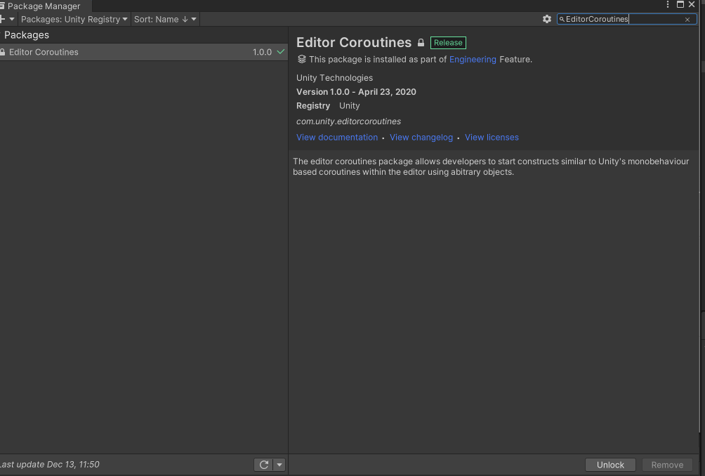

**4. 引入SDK之后，遇见'TMPro'找不到的问题**
  1. 方法一：工程没有用到**TextMeshPro** ，将工具**WebglInputTMP**脚本删除即可
    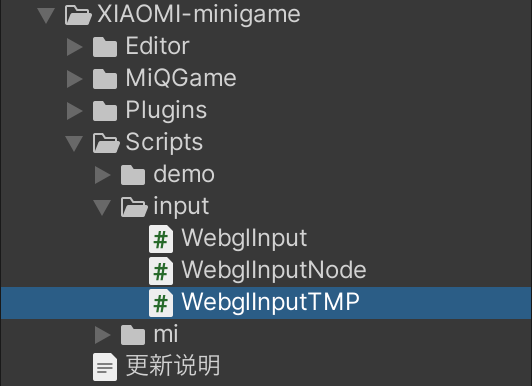

  2. 方法二：请在package manager里面搜索**TextMeshPro**安装即可。
    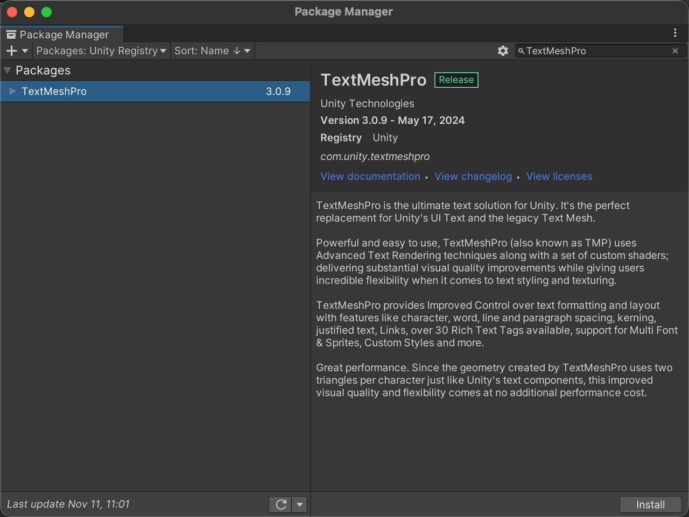

**5. 点击打包按钮没有反应**
  1. 是参数设置问题，重点检查data url，wasm url，streamassets url三个url是否有相等的情况。
  解决办法：把三个url改成不同的即可。